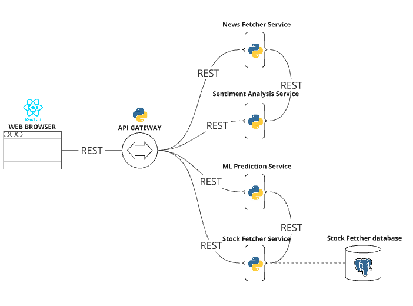

# Sistema de Sugestão de Investimentos

O objetivo principal do projeto é auxiliar os investidores com uma ferramenta que utilize aprendizado de máquina e processamento de linguagem natural (NLP) para criar previsões precisas de preços e tendências sobre o mercado de ações.



## Sumário

- [Estrutura de Microserviços](#estrutura-de-microserviços)
  - [API Gateway](#api-gateway)
  - [User Service](#user-service)
  - [Portfolio Service](#portfolio-service)
  - [News Fetcher Service](#news-fetcher-service)
  - [Sentiment Analysis Service](#sentiment-analysis-service)
  - [ML Prediction Service](#ml-prediction-service)
  - [Stock Fetcher Service](#stock-fetcher-service)
- [Extra](#extra)

## Estrutura de Microserviços

1. **API Gateway**
2. **User Service**
3. **Portfolio Service**
4. **News Fetcher Service**
5. **Sentiment Analysis Service**
6. **ML Prediction Service**
7. **Stock Fetcher Service**

## API Gateway
### **Descrição**
Centraliza as requisições dos clientes e distribui para os microserviços.

### **Endpoints**
Todos os endpoints dos microserviços.

## User Service
### **Descrição**
Gerencia as informações dos usuários e o login.

### Endpoints iniciais
`POST /api/user/new`
Descrição: Cria um usuário

`GET /api/user/{user_id}`
Descrição: Retorna um usuário

`PATCH /api/user/{user_id}`
Descrição: Edita um usuário


### **Banco de Dados**
  PostgreSQL

### **Tecnologias**
  Java, Spring Boot

### **Requisitos do Microserviço**
- Cadastro e autenticação de usuários.
- Gerenciamento de sessões.
- O sistema deve permitir que o usuário crie e gerencie sua conta
- O sistema não deve permitir criar um usuário com um CPF já cadastrado

## Portfolio Service
### **Descrição**
Armazena e gerencia informações sobre as ações do cliente.

### **Endpoints iniciais**

`POST /api/portfolio/{user_id}/new`
Descrição: Cria um novo portfolio

`GET /api/portfolio/{user_id}/{portfolio_id}`
Descrição: Retorna o portfolio do usuário

`PATCH /api/portfolio/{user_id}/{portfolio_id}`
Descrição: Edita o portfolio

`POST /api/portfolio/{user_id}/{portfolio_id}/?company_symbol={symbol}`
Descrição: Adiciona empresa no portfolio

`DELETE /api/portfolio/{user_id}/{portfolio_id}/?company_symbol={symbol}`
Descrição: Remover empresa do portfolio

### **Banco de Dados**
PostgreSQL

### **Tecnologias**
Java, Spring Boot

### **Requisitos do Microserviço**
- Armazenar detalhes das ações possuídas pelos clientes.
- Realizar cálculos de rentabilidade.
- O sistema deve permitir que o usuário crie e gerencie seu portfolio
- O sistema deve permitir que o usuário adicione e remova empresas em seu portfolio
- O sistema não deve permitir que o usuário crie um portfolio com um nome repetido
- O sistema não deve permitir que o usuário adicione uma empresa já inserida em seu portfolio

## News Fetcher Service
### **Descrição**
Centraliza a obtenção de dados por API (notícias e ações).

### **Endpoints Iniciais**
- `GET /api/news/{company}/today`: Obter noticias de uma empresa no período de 24 horas
- `GET /api/news/{company}?start={date}&end={date}`: Obter noticias de uma empresa em um período específico

### **Tecnologias**
Python, Flask

### **Requisitos do Microserviço**
- Conectar a APIs externas para obter notícias relevantes.

## Sentiment Analysis Service
### **Descrição**
Análise de sentimento em notícias utilizando deep learning.

### **Endpoints Iniciais**
- `GET /sentiment-analysis-service/analyze/`: Obter a análise de sentimento das notícias da empresa requisitada.

- `GET /sentiment-analysis-service/api/acoes/{simbolo}/historico`
Descrição: Retorna os dados históricos de preços de uma ação específica.

- `GET /sentiment-analysis-service/api/acoes/{simbolo}/previsao`
Descrição: Retorna as previsões de preços futuros para uma ação específica.

- `GET /sentiment-analysis-service/api/acoes/{simbolo}/noticias`
Descrição: Retorna as notícias mais recentes relacionadas a uma ação específica.

- `GET /sentiment-analysis-service/api/acoes/{simbolo}`
Descrição: Retorna detalhes básicos sobre a ação, como nome da empresa e setor.

- `GET /sentiment-analysis-service/api/acoes`
Descrição: Retorna uma lista de todas as ações disponíveis

- `GET /sentiment-analysis-service/api/acoes/{simbolo}/explicacao-variacao`
Descrição: Explicacao da variacao da acao

### **Banco de Dados**
SQL

### **Tecnologias**
Python, PyTorch, FastAPI

### **Requisitos do Microserviço**
- Implementar modelos de deep learning para análise de sentimento.
- Fornecer resultados em tempo real.

## ML Prediction Service
### **Descrição**
Previsão de ações utilizando machine learning.

### **Endpoints Iniciais**
- `GET /ml-prediction-service/predict/`: Obter previsão de ações sobre a empresa requisitada.
- `POST /ml-prediction-service/train_model/`: trigger para treinar diarimente o modelo de machine learning  

### **Banco de Dados**
PostgreSQL

### **Tecnologias**
Python, C++, scikit-learn, FastAPI

### **Requisitos do Microserviço**
1. Treinar modelos de machine learning diariamente.
2. Fornecer previsões diárias com base nos dados mais recentes.

## Stock Fetcher Service
### **Descrição**
Obtém e gerencia dados de ações.

### **Endpoints Iniciais**
- `POST /stock-fetcher-service/add_company/?company_symbol={symbol}`: Adicionar uma nova empresa no banco de dados.
- `GET /stock-fetcher-service/stock-data/?company_id={ID}&start_date={start_date}&end_date={end_date}`: Obter dados de ações para gráficos dinâmicos.
- `GET /stock-fetcher-service/ml-stock-data/?company_id={ID}`: Enviar dados das ações para treinamento de machine learning.

### **Banco de Dados**
PostgreSQL

### **Tecnologias**
Python, FastAPI

### **Requisitos do Microserviço**
1. **Armazenamento de Dados Históricos:** Armazenar informações como data, abertura, fechamento, mínima, máxima e volume para várias empresas.
2. **Desempenho Rápido de Leitura:** Leituras rápidas entre datas específicas para gráficos dinâmicos.
3. **Treinamento de Modelos de Machine Learning:** Acesso diário ao banco de dados para treinamento de modelos.
4. **Escalabilidade Futura:** Preparado para incluir mais empresas e novas métricas no futuro.

### **Justificativa da Escolha do PostgreSQL**

Optamos por PostgreSQL devido às suas capacidades de:

1. **Desempenho Rápido de Leitura:** Suporte avançado a índices para consultas rápidas.
2. **Consistência e Confiabilidade:** Transações ACID para garantir dados sempre corretos.
3. **Consultas Complexas e Agregações:** Eficiência em consultas complexas para análises detalhadas.
4. **Ferramentas de Administração e Manutenção:** Ferramentas robustas para backup, replicação e manutenção.
5. **Flexibilidade para Escalabilidade:** Soluções para escalabilidade horizontal conforme necessário.

## Extra

### Comandos para Configuração e Execução

```bash
# Construir e iniciar os serviços
docker-compose up --build

# Iniciar o servidor frontend
cd frontend
python -m http.server 8080

# Testar a API Stock Fetcher Service
curl.exe -X GET "http://localhost:8000/stocks/?symbol=AAPL&start_date=2000-01-01"

# Adicionar nova empresa
curl.exe -X POST "http://localhost:8000/stock-fetcher-service/add_company/?company_symbol=AAPL"

# Obter dados de ações para gráficos
curl.exe -X GET "http://localhost:8000/stock-fetcher-service/stock-data/?company_id=1&start_date=2023-01-01&end_date=2023-12-31"

# Obter dados para treinamento de ML
curl.exe -X GET "http://localhost:8000/stock-fetcher-service/ml-stock-data/?company_id=1"

